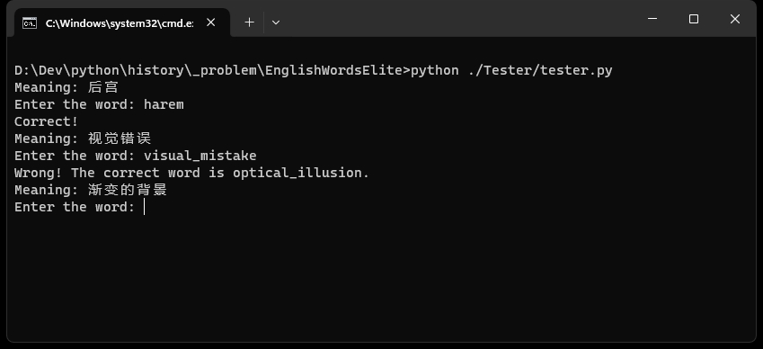

# sd-prompt-recall

**This project is not very interesting because it is mainly used to test and use the functionality of GitHub.**

`sd-prompt-recall` is a lightweight English word tester designed to help users enhance their vocabulary through word recitation. The project includes a built-in **stable diffusion prompt word list** (Chinese to English). Users can also customize their word lists by following a simple process.



## Features

- **Built-in Word List:** The project comes with a pre-loaded stable diffusion prompt word list (cn-en) to get you started quickly.

- **Customizable Word Lists:** Users can use their own word lists. Simply prepare a text file with each line formatted as "word meaning," replace the default `./WordList/words.txt` with your file, and run the provided script to generate a CSV word list.

- **Easy Setup:** Only Python needs to be added to your environment path. Double-click the `play.bat` file, and the program will run using Python.

- **Performance Tracking:** The program keeps track of how many times a word has been tested and how many times it was correctly spelled.

- **Random Word Selection:** A word from the list, which has been least correctly spelled, is randomly selected and presented to the user for practice.

- **Special Input**: If the user inputs `pass`, the total count and the correct count for that word will increase by 100. This ensures that the word will not be displayed in the short term.

## Getting Started

1. **Prerequisites:**
   - Ensure Python is added to your environment path.

2. **Clone the Repository:**
   ```
   git clone https://github.com/Welkin507/sd-prompt-recall.git
   ```

3. **Run the Program:**
   - Double-click the `play.bat` file to start the program.

4. **Customize Word List:**
   - Prepare a text file with each line formatted as "word meaning."
   - Replace `./WordList/words.txt` with your file.
   - Double-click `./WordList/reset.bat` to generate a CSV word list.

5. **Review Your Progress:**
   - The program records and displays the number of times each word has been tested and correctly spelled.

## License

This project is licensed under the MIT License - see the [LICENSE](LICENSE) file for details.

Enjoy improving your English vocabulary with sd-prompt-recall!
